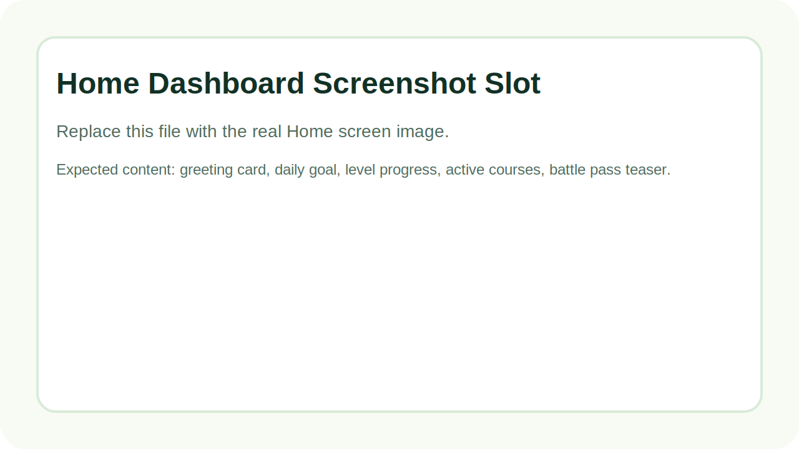
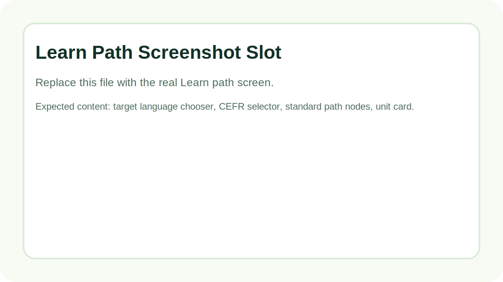
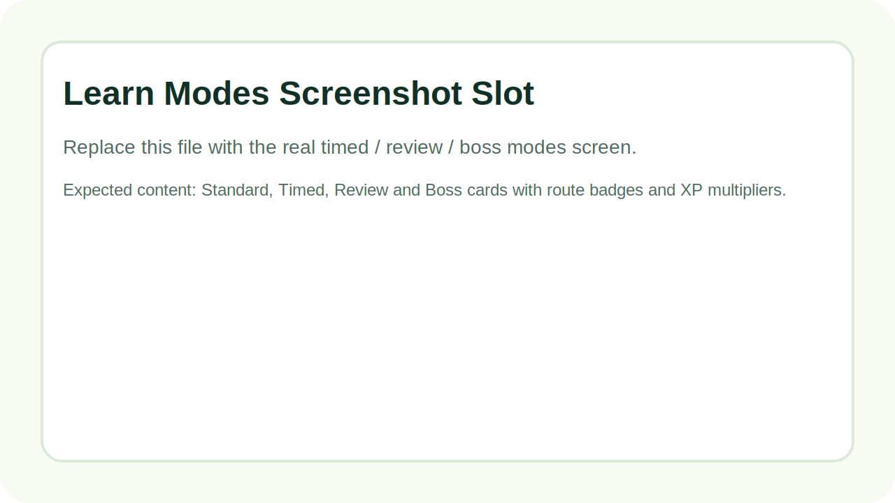
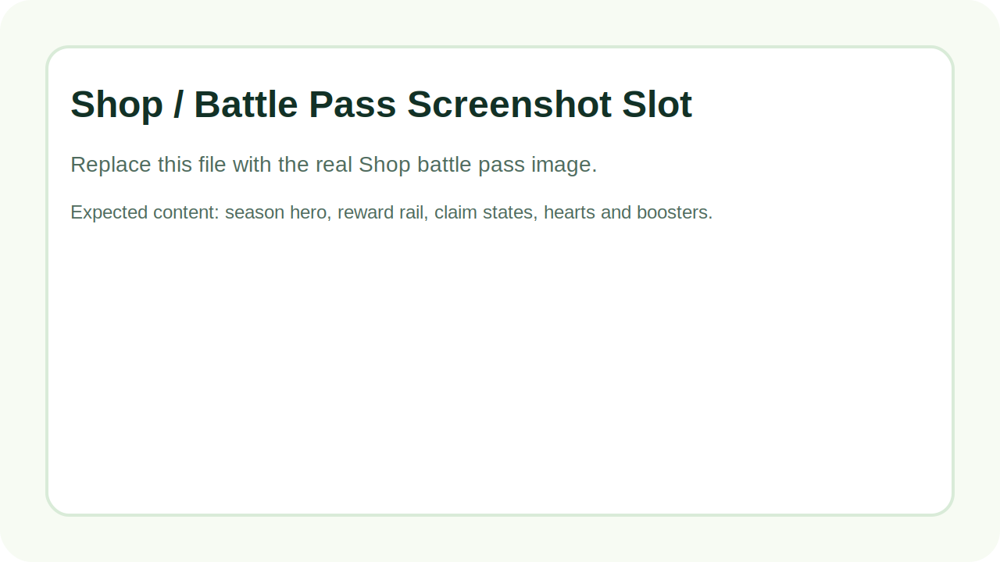
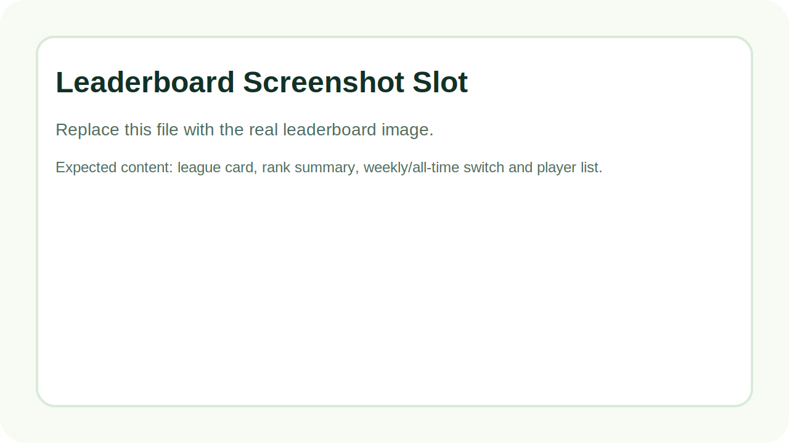
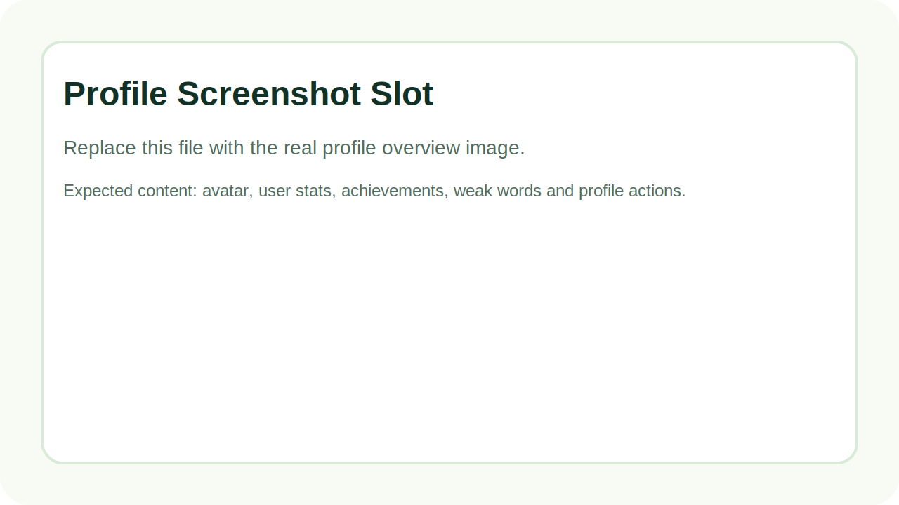
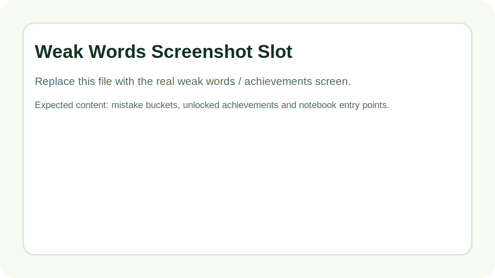

# LinguaLeap    


LinguaLeap, oyunlaştırılmış dil öğrenme deneyimini modern mobil ürün diliyle birleştiren bir React Native / Expo uygulaması. Uygulama; gerçek kullanıcı hesabı, seviye sistemi, battle pass, günlük hedefler, lig tablosu, weak words takibi, placement assessment ve telaffuz odaklı ders akışlarıyla birlikte çalışır.

Bu repo şu anda yalnızca bir demo arayüz değil. Kullanıcı profili, lesson progress, achievement, streak, battle pass, reward chest, leaderboard ve soru geçmişi gerçek veri modeli üzerinden yönetilir.

## Ürün Özeti

- Çok dilli öğrenme akışı: `English`, `Deutsch`, `Español`, `Türkçe`
- CEFR tabanlı ilerleme: `A0` → `C2`
- Placement test ile rota ve zorluk ayarı
- Standard / Timed / Review / Boss ders modları
- Speech recognition ile telaffuz pratikleri
- Battle pass, chest ve booster odaklı gamification katmanı
- Günlük görevler, streak, level progress ve lig sistemi
- Weak words ve mistake notebook odaklı tekrar sistemi
- Gerçek cihazda çalışan Expo development build akışı

## Arayüz Galerisi

Bu bölümdeki görseller repo içinde yer tutucu olarak eklendi. Gerçek ekran görüntülerini aynı dosya yollarına koyduğunda GitHub üzerinde doğrudan burada görünecekler.

### Ana Sayfa



Ana sayfa; günlük hedef, level ilerlemesi, battle pass teaser alanı, aktif kurslar ve görev kartlarını tek merkezde toplar. Kullanıcının o gün ne yapması gerektiğini doğrudan gösteren “command center” rolündedir.

### Öğrenme Yolu



Learn ekranı; öğrenilecek dili seçme, aktif CEFR seviyesini görüntüleme ve lesson path üzerinde bölüm bölüm ilerleme mantığını taşır. A0’dan başlayıp C2’ye kadar açılabilen bir rota sistemi vardır.

### Oyun Modları



Learn ekranındaki mod şeridi yalnızca tek bir ders akışı sunmaz. Standard path’in yanında Timed, Review ve Boss modlarıyla aynı içerik farklı kurallarla tekrar oynanabilir hale gelir.

### Mağaza ve Battle Pass



Mağaza ekranında battle pass ana merkez olarak konumlanır. Reward rail, premium lane, claim durumları, kalpler ve güçlendiriciler aynı görsel sistem altında toplanır.

### Lig ve Sıralama



Leaderboard ekranı lig sistemi, haftalık sıralama ve toplam XP üzerinden kullanıcının diğer oyuncularla konumunu gösterir. Haftalık motivasyon katmanı burada kurulur.

### Profil



Profil ekranı kullanıcı kartı, toplam XP, taçlar, lig durumu ve achievement alanlarını özetler. Avatar ve temel kullanıcı bilgileri burada yönetilir.

### Weak Words ve Başarımlar



Weak words bölümü kullanıcının en çok zorlandığı kelimeleri ve yanlış/doğru oranlarını gösterir. Bu alan daha sonra mistake notebook ve spaced repetition sisteminin temelini oluşturur.

## Uygulamada Şu Anda Neler Var?

### 1. Öğrenme Sistemi

- Placement assessment sonrası kullanıcıya uygun rota seçilir.
- CEFR seviyeleri kilit/açık mantığıyla tutulur.
- Her dil için ayrı lesson progress kaydı tutulur.
- Her ders sonunda yıldız/crown mantığı yarım adımlarla hesaplanır.
- Node unlock akışı kullanıcı ilerlemesine göre açılır.

### 2. Soru Üretimi

- Genişletilmiş kelime bankası
- Ünite bazlı soru kümeleri
- Tier bazlı bonus vocab
- Yakın distractor cluster mantığı
- Varyasyonlu prompt kalıpları
- Aynı kelime ve aynı soru tipinin arka arkaya dönmesini azaltan freshness mantığı

### 3. Telaffuz ve Speech

- `expo-speech-recognition` ile native pronunciation flow
- Doğru/yanlış telaffuz geri bildirimi
- Basılı tut konuş etkileşimi
- Değerlendirme state’i ve kısa flash bug fix’leri
- Development build üzerinde gerçek cihaz testi için hazır yapı

### 4. Gamification

- Günlük hedef
- Günlük seri
- XP ve level sistemi
- Reward chest
- Battle pass
- Booster ve shop item yapısı
- Achievement sistemi
- Haftalık leaderboard

### 5. Tekrar ve Analiz

- Weak words
- Mistake bucket kayıtları
- Notebook ekranı
- Review mode temeli
- Wrong/correct sayıları ile odak kelime takibi

## Ekranlar ve Sorumlulukları

### Home

- Kullanıcıya o günün ana hedefini gösterir
- Level ve XP progress’ini özetler
- Aktif kursları listeler
- Battle pass’e giriş noktası sağlar
- Günlük görevleri tek yerde sunar

### Learn

- Dil seçimi
- Placement ve CEFR kontrolü
- Path progression
- Lesson node yapısı
- Timed / Review / Boss modları

### Lesson

- Translate
- Select
- Fill blank
- Listen
- Pronounce

Bu ekran uygulamanın asıl “core loop” kısmıdır.

### Shop

- Battle pass yönetimi
- Reward claim state’leri
- Kalp doldurma
- Booster satın alma
- Premium / Super teaser alanı

### Leaderboard

- Lig görünümü
- Haftalık ve genel sıralama
- Kullanıcı pozisyonu
- Yükselme / düşme bölgesi mantığı

### Profile

- Avatar ve hesap bilgileri
- İstatistik kartları
- Achievement grid
- Weak words listesi
- Yardım / ayarlar / çıkış alanı

## Teknik Mimari

```text
src/
├── components/
│   ├── AppSymbol.tsx
│   ├── LessonNode.tsx
│   ├── ProgressBar.tsx
│   ├── TopBar.tsx
│   └── UnitHeader.tsx
├── config/
│   └── firebase.ts
├── context/
│   ├── AppContext.tsx
│   ├── AuthContext.tsx
│   └── LanguageContext.tsx
├── data/
│   ├── learningContent.ts
│   └── mockData.ts
├── hooks/
│   └── index.ts
├── i18n/
│   └── translations.ts
├── navigation/
│   └── RootNavigator.tsx
├── screens/
│   ├── auth/
│   ├── HomeScreen.tsx
│   ├── LearnScreen.tsx
│   ├── LessonScreen.tsx
│   ├── LeaderboardScreen.tsx
│   ├── MistakesNotebookScreen.tsx
│   ├── ProfileScreen.tsx
│   └── ShopScreen.tsx
├── services/
│   └── firestore.ts
├── theme/
│   └── colors.ts
└── types/
    └── index.ts
```

## Temel Sistemler Nasıl Çalışıyor?

### Auth ve Kullanıcı Profili

- Firebase Auth ile kayıt / giriş / şifre sıfırlama yapılır.
- İlk kayıt sonrası kullanıcı profili Firestore’da oluşturulur.
- Profil içinde level, XP, streak, crowns, battle pass ve learn preferences tutulur.

### Lesson Progress

- Ders tamamlanınca score ve crown bilgisi kaydedilir.
- İlerleme aktif hedef dil bazında da ayrı tutulur.
- Sonraki node açılımı bu kayda göre hesaplanır.

### Battle Pass

- Battle pass level’i toplam battle pass XP ile hesaplanır.
- Free ve premium reward lane mantığı vardır.
- Reward claim işlemi profile yazılır.
- Claimed / ready / locked durumları UI’da ayrı state’lerle gösterilir.

### Question Generator

- Soru üretimi `src/data/learningContent.ts` içinde çalışır.
- Sistem şu girdilere göre soru üretir:
  - hedef dil
  - UI dili
  - assessment tier
  - learn mode
  - zayıf kelimeler
  - recent question geçmişi
- Amaç aynı soruları tekrar tekrar döndürmeden, bağlama daha uygun ve birbirine yakın seçenekler üretmektir.

### Weak Words / Mistake Tracking

- Her soru outcome’u `correct / wrong` olarak işlenir.
- Focus kelimeler kullanıcı profiline mistake bucket olarak yazılır.
- Profile ve notebook ekranı bu veri üzerinden beslenir.

## Veri Modeli

Kullanıcı tarafında bugün aktif kullanılan ana bloklar:

- `placement`
- `battlePass`
- `rewardChests`
- `learnPreferences`
- `lessonProgress`
- `mistakeBuckets`
- `completedLessons`

Bu yapı sayesinde tek bir kullanıcı dokümanından ürünün büyük kısmı beslenebiliyor. Uzun vadede bu sistemin bazı parçalarının daha atomik koleksiyonlara ayrılması planlanıyor.

## Geliştirme Ortamı

### Gereksinimler

- Node.js
- npm
- Xcode
- iOS Simulator veya gerçek iPhone
- Firebase projesi

### Kurulum

```bash
git clone https://github.com/efeberktnci/LinguaLeap.git
cd LinguaLeap
npm install
```

Ardından:

```bash
npm start
```

iOS simülatör:

```bash

npm run ios
```

Gerçek cihaz development build:

```bash
npm run ios:run:device
```

## Faydalı Komutlar

```bash
npm start
npm run ios
npm run ios:run:device
npm run type-check
npm test -- --runInBand
npx expo export -p all --clear
```

## Son Büyük Çalışmalar

- iPhone development build zinciri çalışır hale getirildi
- Speech recognition akışı entegre edildi
- Learn path ve CEFR progression geliştirildi
- Battle pass / shop tasarımı büyütüldü
- Weak words ve notebook sistemi eklendi
- Question generator ciddi şekilde genişletildi
- Profile, Home, Shop, Leaderboard ve Learn ekranları aynı ürün dili altında toparlandı

## Sonraki Büyük Adımlar

- Server-backed question bank
- Mastery + spaced repetition engine
- Secure reward ledger
- Battle pass sezonlarının backend’den gelmesi
- Story / conversation mode derinleştirmesi
- Speech scoring v2

